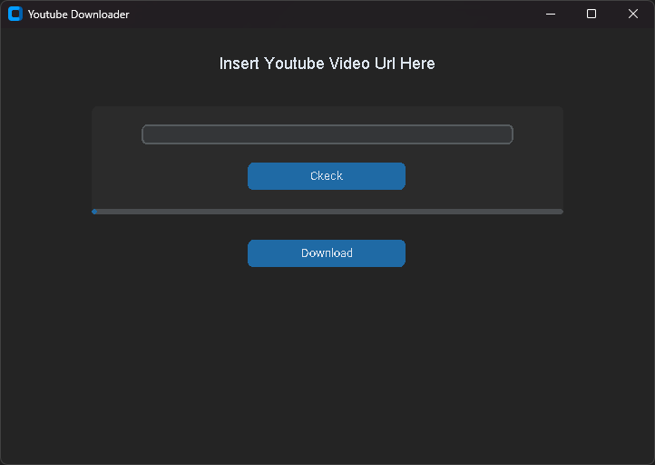

# Youtube Video Downloader (Deprecated)

Cette application Python permet de télécharger des vidéos YouTube avec une interface graphique intuitive utilisant `customtkinter`.

Ce projet ne marche plus, changement de l'api de Youtube ?



## 📌 Fonctionnalités

✔️ Téléchargement de vidéos YouTube à différentes résolutions (144p - 2160p)  
✔️ Sélection de la résolution via une interface interactive  
✔️ Indicateur de progression du téléchargement  
✔️ Compatibilité Windows et Linux

## 🚀 Installation

Assurez-vous d'avoir Python 3.x installé, puis exécutez :

```sh
pip install customtkinter pytube
```

🔹 Installez également `ffmpeg` si nécessaire, pour linux, executez :
```sh
sudo apt install ffmpeg
```

## 🛠️ Utilisation

1. Clonez le dépôt :
   ```sh
   git clone https://github.com/utilisateur/Youtube-Downloader.git
   ```
2. Accédez au dossier du projet :
   ```sh
   cd Youtube-Downloader
   ```
3. Exécutez le programme :
   ```sh
   python main.py
   ```

## 📌 Fonctionnalités futures

🔹 Interface améliorée avec plus d'options  
🔹 Gestion des playlists  
🔹 Option pour télécharger uniquement l'audio en MP3  
🔹 Choix du dossier de téléchargement  
🔹 Historique des téléchargements

## 📩 Contact

Si vous avez des questions ou suggestions, contactez-moi à [Sami.HALILOU@etu.uca.fr](mailto:Sami.HALILOU@etu.uca.fr)

